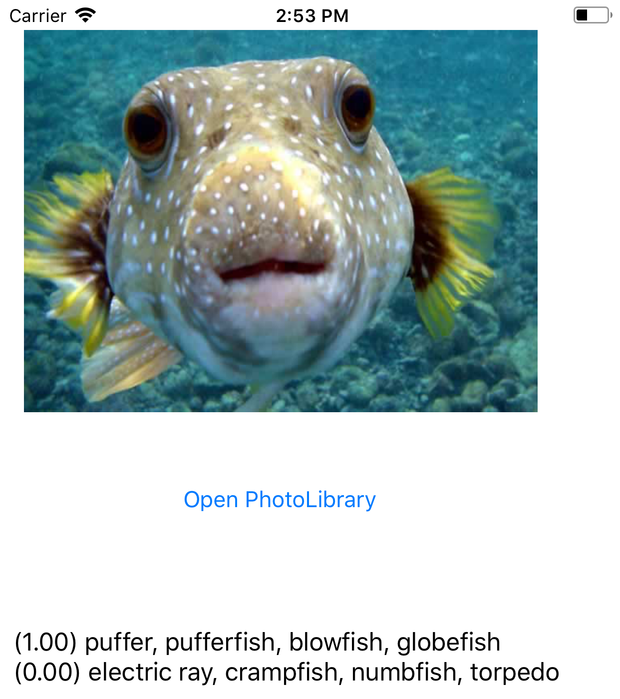

Beschrijving van de PoC's
==========================

Geef een beschrijving van de test die je gedaan hebt met elk Proof of Concept. Voeg de code ook toe in de map **code**.
 
Core Image
----------------
* **testopzet:**  
 1. Inlezen in Core Image
 2. POC maken
 3. POC testen

* **resultaat:**  
De volgende code is hiervoor gebruikt.
```swift
    @IBAction func processImage(_ sender: UIButton) {
        ciImage = CIImage(image: beforeProcessingImage.image!)
        let filter = CIFilter(name: "CISepiaTone")
        let context = CIContext(options: nil)
        filter?.setValue(ciImage, forKey: kCIInputImageKey)
        filter?.setValue(5.5, forKey: kCIInputIntensityKey)
        
        let sepiaImage = filter?.outputImage?.applyingFilter("CIBoxBlur", parameters: [kCIInputRadiusKey : 100.0])
        if let cgimg = context.createCGImage(sepiaImage!, from: (sepiaImage?.extent)!) {
            let processedImage = UIImage(cgImage: cgimg, scale: (beforeProcessingImage.image?.scale)!, orientation: (beforeProcessingImage.image?.imageOrientation)!)
            afterProcessingImage.image = processedImage
        }
    }
```
Dat geeft onderstaand resultaat.  


Core MachineLearning
----------------
* **testopzet:**  
1. Inlezen in CoreML
 2. POC maken
 3. POC testen

* **resultaat:**  
De volgende code is hiervoor gebruikt:
```swift
                let orientation = CGImagePropertyOrientation(rawValue: UInt32(pickedImage.imageOrientation.rawValue))
                let handler = VNImageRequestHandler(ciImage: CIImage(image: pickedImage)!, orientation: orientation!)
                do {
                    try handler.perform([self.request])
                } catch {
                    /*
                     This handler catches general image processing errors. The `classificationRequest`'s
                     completion handler `processClassifications(_:error:)` catches errors specific
                     to processing that request.
                     */
                    print("Failed to perform classification.\n\(error.localizedDescription)")
                }
```
```swift
        let classifications = request.results as! [VNClassificationObservation]
        let topClassifications = classifications.prefix(2)
        let descriptions = topClassifications.map { classification in
            // Formats the classification for display; e.g. "(0.37) cliff, drop, drop-off".
            DispatchQueue.main.async { [weak self] in
                self?.textLabel.text?.append(String(format: "  (%.2f) %@\n", classification.confidence, classification.identifier))
            }
            print(String(format: "  (%.2f) %@", classification.confidence, classification.identifier))
        }
```
Bovenstaande code geeft onderstaand resultaat.  
