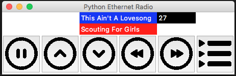

Beschrijving van de PoC's
==========================

Geef een beschrijving van de test die je gedaan hebt met elk Proof of Concept. Voeg 
 de code ook toe in de map **code**.
 
Python Radio
----------------
* **testopzet:**  
 1. Uitzoeken / testen wat de mpd2 client allemaal en zorgen dat ik de basic dingen kan doen.
    1.  Spelen en stoppen
    2. Hudige nummer en artiest.
 2. Tutorial volgen van Python met Tkinter.
 3. Stap 1 en 2 samen voegen om een radio GUI te bouwen die gebruikt maakt van Tkinter en mpc om de mpd server aan te sturen.

* **resultaat:**  
Dat geeft onderstaand resultaat.
