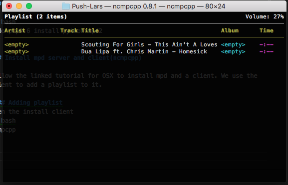
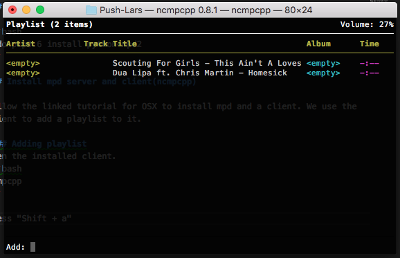

# Installation Manual

## Required Software and Hardware

* Python 3.6.4 download it form [here](https://www.python.org/downloads/).
* [mpd client](https://github.com/Mic92/python-mpd2).
* mpd server for OSX follow this [tutorial](https://timothy.sh/article/install-mpd-ncmpcpp-on-osx-yosemite).

## Installation

### Install python

Follow the onscreen instructions to install Python 3.6.4.

### Install mpd client

```bash
sudo pip3.6 install python-mpd2
```

### Install mpd server and client(ncmpcpp)

Follow the linked tutorial for OSX to install mpd and a client. We use the client to add a playlist to it.

#### Adding playlist

Run the mpd server

```bash
mpd
```

Open the installed client.

```bash
ncmpcpp
```

  
Press "Shift + a" to add a new playlist.  
  
I added a link to a radio stream (http://playerservices.streamtheworld.com/api/livestream-redirect/RADIO10AAC.aac) After that press "Enter" and than "q" to quit the application.

### Running the python radio

Make sure you are inside the "Radio" directory than use the following command:

```bash
python3.6 main.py
```

You should see:  
