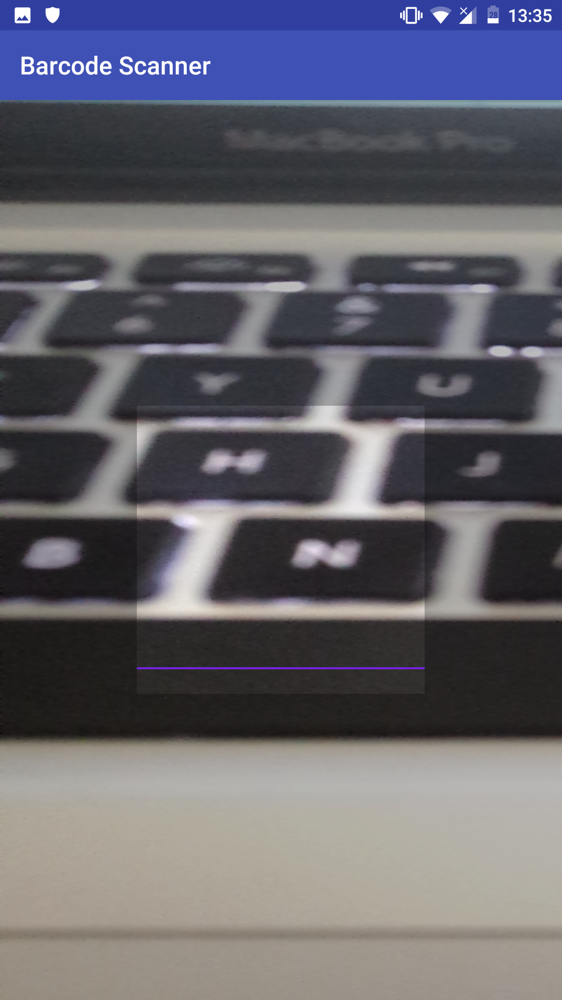
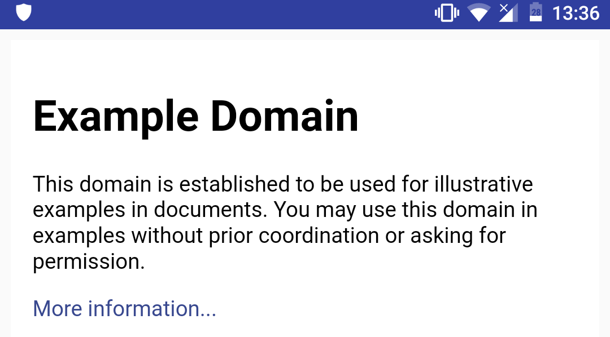

Beschrijving van de PoC's
==========================

Geef een beschrijving van de test die je gedaan hebt met elk Proof of Concept. Voeg 
 de code ook toe in de map **code**.
 
QR code uitlezen en link weergeven op een web pagina.
----------------
* **testopzet:**  

1. De codelab van Android Vision gegaan om barcode te herkennen in een plaatje. Dit ging goed maar daarna werd je in het diepe gelaten hoe je de camera ervoor moest gebruiken. Na wat gegoogled te hebben hoe je in android de camera moest gebruiken kwam ik een library tegen die je kon gebruiken voor het scannen van barcodes.
2. De URL openen in een webview. Dit bleek niet meteen te werken omdat mijn browser geopend werd ipv dat de pagina in de app zelf werd weergegeven. Ik kwam deze post op [stackoverflow](https://stackoverflow.com/a/34924153) tegen. Hierdoor werd de web pagina in de app wel geopend.

* **resultaat:**

De webpagina wordt geopend wanneer de QR code een URL heeft.
Dat geeft onderstaand resultaat.
