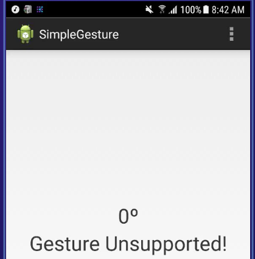

Beschrijving van de PoC's
==========================

Geef een beschrijving van de test die je gedaan hebt met elk Proof of Concept. Voeg 
 de code ook toe in de map **code**.
 
Samsung Gesture SDK
----------------
* **testopzet:**  
1. Sample app van Samsung werkend krijgen.
2. Eigen app bouwen die iets met gestures doet

* **resultaat:**  
Samsung had een mooie tutorial online gezet zodat je hun voorbeeld code werkend kon krijgen. Hierin stond aangegeven dat je de SDK die je nodig had moest downloaden, maar de link werkte niet meer. Na wat gegoogeld te hebben ging ik in de libs folder kijken en toevallig stonden daar de benodigde library's in. Hierna probeerde ik de applicatie naar mijn S4 te deployen. Maar doordat ik geen Samsung Android versie meer gebruik crashte de applicatie wanneer die geopend werd. Dat kwam omdat er een aantal classes waren die de SDK nodig had die niet meer aanwezig waren. Toen heb ik bij Testobject en Kobition, Device farms voor het testen van applicaties, gekeken of ze een S4 hadden om daar de applicatie op te testen. Bij TestObject moest je betalen om gebruik te maken van Samsung toestellen. Kobition had alleen de S7 en S6. Deze heb ik toen gebruik om de applicatie te testen. Hierbij kon ik de applicatie wel openen zonder dat die crashte. Echter werd hier aangegeven dat gestures niet gesupport werden.  
  
Toen heb ik gekeken hoe het kwam dat een officiele S7 die melding gaf. Het blijkt dus dat de S6 en de S7 geen gesture sensor meer hebben zoals de S4 en de S5. De S6 en S7 maken namelijk gebruik van de front camera en de proximity sensor.